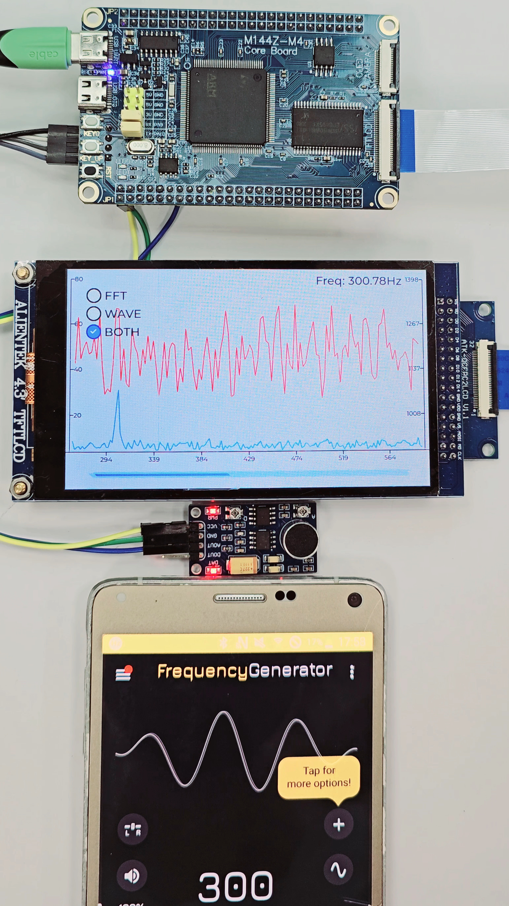

# LVGL FFT Display

本專案為一個基於 **STM32F407ZGT6 + LVGL** 的 FFT 頻譜圖與波形顯示實作範例。  
採用 **ADC + DMA** 方式取得原始波形，並透過 ARM CMSIS-DSP 的 `arm_rfft_fast_f32()` 執行 FFT 分析，最後以 LVGL 呈現圖形化頻譜與波形結果。

---

## 🎯 專案設計說明

實際開發過程中，程式碼依功能模組拆分如下：

| 檔案          | 功能說明                       |
|---------------|--------------------------------|
| `AD.c/h`       | 負責 ADC 採樣與 DMA 配置         |
| `FFT.c/h`      | FFT 計算（含輸入轉換與最大頻率追蹤） |
| `lv_mainstart.c/h` | 初始化 LVGL 介面與 UI 架構建立 |

不過為了方便下載者快速使用，本版本的程式碼將上述邏輯 **整合至單一 `main.c` 檔案中**，  
以利使用者不需處理多檔之間的參數傳遞問題，可直接複製修改實作。

---

## 📷 示意畫面

如上圖所示，畫面上整合了即時波形與 FFT 頻譜顯示功能：

- 下方 **滑塊** 可用來調整顯示 FFT 與波形點數
- 介面兩側的 **scale**：
  - **左側為 FFT 對應的 dB 值刻度**
  - **右側為原始波形對應的電壓範圍刻度**
- 下方中間可顯示 **FFT 頻率範圍**
- 可選擇顯示「僅 FFT」、「僅 Waveform」或「同時顯示」三種模式
---

## 💡 使用環境與參考來源
- 📚 參考資料：  
  > 【正点原子】2022年新版手把手教你学 LVGL 系列

- 為了相容最新版本的 LVGL，本專案已：
  - ❌ 完全移除正點原子原本工程內建的舊版 LVGL
  - ✅ 改為透過 Keil RTE 管理器 引入 官方提供的最新版 LVGL 元件
